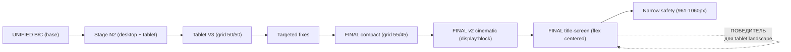

# Аудит типографики, сетки и интервальной логики — MALEA «Сакральный артист»

> **Статус:** Аудит | **Ничего не менять в коде** | **Дата:** 2026-05-25

---

## Этап 1 — Классификация 27 экранов по типам (A–F)

### Типология экранов

| № | ID | Название | Тип | Full-bleed? | Сетка | Анимация |
|---|----|----------|-----|-------------|-------|----------|
| 01 | `#intro` | Intro — логотип | **A — Intro/Logo** | Да | flex, centered | gold shimmer |
| 02 | `#hero` | Hero — фото + имя | **B — Split Hero** | Да (55/45) | 55% img / 45% text | hint pulse |
| 03 | `#identity` | Identity | **C — Editorial Split** | Нет | 46/54 rail grid | hover fade |
| 04 | `#philosophy` | Philosophy | **D — Content Rail** | Нет | 44/56 rail (1220px) | — |
| 05 | `#live-image` | Live Image | **F — Full-Bleed Image** | Да | 100% img | — |
| 06 | `#live-text` | Live Text | **D — Content Rail** | Нет | 48/1px/52 rail (1220px) | — |
| 07 | `#quote` | Quote | **E — Quote** | Нет | centered, max-width | — |
| 08 | `#player` | Player | **D — Content Rail** | Нет | header 60/40 + 3-col grid | CD spin, waveform |
| 09 | `#performance` | Performance | **D — Content Rail** | Нет | 34/66 + video 2×2 | video hover |
| 10 | `#art` | Art | **C — Editorial Split** | Нет | 56/40 + 68/32 wall | video hover |
| 11 | `#musicians` | Musicians | **C — Editorial Split** | Нет | rail (60/40 approx) | — |
| 12 | `#musicians-gallery` | Musicians Gallery | **D — Content Rail** | Нет | 3-col grid | — |
| 13 | `#sensations` | Sensations | **D — Content Rail** | Нет | max-width rail | marquee |

| № | ID | Название | Тип | Full-bleed? | Сетка | Анимация |
|---|----|----------|-----|-------------|-------|----------|
| 14 | `#reviews` | Reviews | **D — Content Rail** | Нет | carousel + 4-col cards | — |
| 15 | `#malea-quote-screen` | Malea Quote | **E — Quote** | Нет | centered | — |
| 16 | `#egypt` (intro) | Egypt Intro | **A — Chapter Title** | Нет | centered, 980px | — |
| 17 | `#egypt-case` | Egypt Case | **C — Editorial Split** | Нет | 42/50 grid (1360px) | video modal |
| 18 | `#formats` | Formats Title | **A — Chapter Title** | Нет | centered | — |
| 19 | `#formats-list` | Formats List | **D — Content Rail** | Нет | 32/1fr list (1320px) | hover |
| 20 | `#formats-integration` | Formats Integration | **D — Content Rail** | Нет | 3-col panels | hover |
| 21 | `#why` | Why Title | **A — Chapter Title** | Нет | centered | — |
| 22 | `#why-image` | Why Image | **F — Full-Bleed Image** | Да | 100% img | — |
| 23 | `#why-argument` | Why Argument | **D — Content Rail** | Нет | 3-col argument cards | hover |
| 24 | `#portfolio` | Portfolio | **B — Split Hero** | Да (46/54) | 46/54 split → responsive | — |
| 25 | `#portfolio-map` | Portfolio Map | **D — Content Rail** | Нет | 1.1/1.2/1fr 3-col | reveal motion |
| 26 | `#portfolio-quote` | Portfolio Quote | **E — Quote** | Нет | centered | — |
| 27 | `#final-experience` | Final Experience | **B — Split Hero** | Да (52/48) | 52/48 split | — |

### Сводка по типам

| Тип | Описание | Экраны |
|-----|----------|--------|
| **A** | Intro / Chapter Title | 01, 16, 18, 21 |
| **B** | Split Hero (full-bleed) | 02, 24, 27 |
| **C** | Editorial Split (rail) | 03, 10, 11, 17 |
| **D** | Content Rail (сетки/списки) | 04, 06, 08, 09, 12, 13, 14, 19, 20, 23, 25 |
| **E** | Quote / Ceremonial | 07, 15, 26 |
| **F** | Full-Bleed Image | 05, 22 |

### Ключевые наблюдения

- **3 типа full-bleed:** Intro (01), Hero (02), Live-image (05), Why-image (22), Portfolio (24), Final-experience (27) — но с разной внутренней логикой
- **Flow-обёртки:** `.experience-flow` (08–10), `.reviews-flow` (13–15), `.formats-flow` (18–20), `.portfolio-flow` (24–26) — влияют на фон и padding
- **Двойная природа Screen 24:** на десктопе — split hero (B), на планшете ландшафт — title screen (A) с радиальным градиентом

---

## Этап 2 — Аудит заголовков (heading selectors)

### CSS Custom Properties (токены)

```css
--f-display: clamp(88px, 11vw, 152px)  /* Intro MALEA logo */
--f-hero:    clamp(72px, 9vw, 124px)    /* Hero name */
--f-section: clamp(44px, 5vw, 70px)     /* Section titles (portfolio, philosophy) */
--f-title:   clamp(30px, 3.2vw, 46px)   /* Identity headline */
--f-body:    clamp(16px, 1.4vw, 19px)   /* Body text */
--f-subtitle:clamp(22px, 2.4vw, 32px)   /* Second-level */
--f-micro:   12px                        /* Overlines, buttons */
--font-d:    'Leotaro', Georgia, serif   /* Display */
--font-b:    'Circe', Arial, sans-serif  /* Body */
--font-q:    'Cormorant Garamond', Georgia, serif  /* Quotes */
```

### Таблица заголовков (десктоп/base значения)

| Селектор | Экран | font-family | font-size | line-height | letter-spacing | text-align | margin-bottom | Группа |
|----------|-------|-------------|-----------|-------------|----------------|------------|---------------|--------|
| `.intro-logo` | 01 | `--font-d` | `clamp(88,11vw,152)` | — | `.12em` | center | — | **Display** |
| `.hero-name` | 02 | `--font-d` | `--f-hero` (72–124) | — | — | center | 32px | **Display** |
| `.identity-headline` | 03 | `--font-d` | `--f-title` (30–46) | 1.18 | `.04em` | left | 28px | **B/C** |
| `.philosophy-title` | 04 | `--font-d` | `--f-section` (44–70) | 1.12 | `.04em`? | left | — | **D** → unified |
| `.live-title` | 06 | `--font-d` | `clamp(40,5vw,62)` | 1.12 | `.04em` | center | — | **B/C** → unified |
| `.quote-text` | 07 | `--font-q` | `clamp(32,3.2vw,52)` | 1.36 | `.02em` | center | — | **E — Quote** |
| `.player-title` | 08 | `--font-d` | `clamp(40,5vw,62)` | 1.12 | `.04em` | left | — | **B/C** → unified |
| `.perf-title` | 09 | `--font-d` | `clamp(40,5vw,62)`? | — | — | — | — | **B/C** → unified |
| `.art-title` | 10 | `--font-d` | `clamp(40,5vw,62)` | 1.12 | `.04em` | left | — | **B/C** → unified |
| `.musicians-title` | 11 | `--font-d` | `clamp(46,4.6vw,72)` | 1.12 | `.04em` | left | — | **D** → unified |
| `.sens-title` | 13 | `--font-d` | `clamp(46,4.6vw,72)` | 1.12 | `.04em` | left | — | **D** → unified |
| `.mq-text` | 15 | `--font-q` | `clamp(32,3.2vw,52)` | 1.36 | `.02em` | center | — | **E — Quote** |
| `.egypt-title` | 16 | `--font-d` | `clamp(46,4.6vw,72)` | 1.12 | `.04em` | center | — | **D** → unified |
| `.formats-main-title` | 18 | `--font-d` | `clamp(46,4.6vw,72)` | 1.12 | `.04em` | center | — | **D** → unified |
| `.fi-heading` | 20 | `--font-d` | `clamp(34,4vw,58)` | 1.1 | `.04em` | center | — | **B/C** → unified |
| `.why-title-main` | 21 | `--font-d` | `clamp(46,4.6vw,72)` | 1.12 | `.04em` | center | — | **D** → unified |
| `.why-argument-subtitle` | 23 | `--font-d` | `clamp(34,4vw,58)` | 1.1 | `.04em` | center | — | **B/C** → unified |
| `.portfolio-title` | 24 | `--font-d` | `--f-section` (44–70) | 1.12 | `.04em` | left | — | **B/C** → unified |
| `.portfolio-quote-text` | 26 | `--font-q` | `clamp(32,3.2vw,52)` | 1.36 | `.02em` | center | — | **E — Quote** |
| `.final-experience-title` | 27 | `--font-d` | `clamp(40,5vw,62)` | 1.12 | `.04em` | left | — | **B/C** → unified |

### Блок UNIFIED MAIN HEADINGS (строки 5048–5112)

**Группа D** (экраны 11, 13, 16, 18, 21) — Chapter Titles:
```css
font-size: clamp(46px, 4.6vw, 72px);
line-height: 1.12;
letter-spacing: .04em;
```

**Группа B/C** (экраны 03, 04, 06, 08, 09, 10, 20, 23, 24, 27) — Main Section Titles:
```css
font-size: clamp(40px, 5vw, 62px);
line-height: 1.12;
letter-spacing: .04em;
```

### ⚠️ Найденные несоответствия заголовков

1. **`.intro-logo`** — font-size `clamp(88px, 11vw, 152px)` — уникальный, НЕ участвует в унификации. Letter-spacing `.12em` на мобильных меняется на `.10em` (строка 3778).
2. **`.hero-name`** — font-size `clamp(72px, 9vw, 124px)` — уникальный, НЕ участвует в унификации. Не указан letter-spacing в исходных стилях.
3. **`.identity-headline`** — использует `--f-title` (30–46px), а unified B/C ожидает `clamp(40px, 5vw, 62px)`. **Несоответствие:** десктопный max 46px vs unified 62px. Меньше на ~25%.
4. **`.identity-headline`** — line-height 1.18, unified ожидает 1.12. **Несоответствие.**
5. **`.philosophy-title`** — использует `--f-section` (44–70px), unified ожидает 40–62px. **Несоответствие:** десктоп max 70px > unified 62px. Больше на ~13%.
6. **`.portfolio-title`** — использует `--f-section` (44–70px), unified B/C ожидает 40–62px. **Несоответствие** — выше на ~13%.
7. **`.fi-heading`** — оригинал `clamp(34,4vw,58)` отличается от unified B/C 40–62px. **Несоответствие:** уже.
8. **`.why-argument-subtitle`** — оригинал `clamp(34,4vw,58)` отличается от unified B/C 40–62px. **Несоответствие:** уже.
9. **Группа E (Quote)** — `.quote-text`, `.mq-text`, `.portfolio-quote-text` — корректны: `clamp(32,3.2vw,52)`, lh 1.36, ls .02em, `--font-q`. Единообразны.

---

## Этап 3 — Аудит оверлайнов / микро-меток

### Таблица оверлайнов

| Селектор | Экран | font-family | font-size | letter-spacing | color | text-transform | margin-bottom |
|----------|-------|-------------|-----------|----------------|-------|----------------|---------------|
| `.overline` (hero) | 02 | `--font-b` | `--f-micro` (12px) | `.30em` | `--gold-70` | uppercase | — |
| `.identity-overline` | 03 | `--font-b` | `--f-micro` | `.30em` | `--gold-70` | uppercase | — |
| `.philosophy-overline` | 04 | `--font-b` | `--f-micro` | `.30em` | `--gold-70` | uppercase | — |
| `.player-overline` | 08 | `--font-b` | `--f-micro` | `.30em` | `--gold-70` | uppercase | — |
| `.live-formats-label` | 06 | `--font-b` | 11px (mobile) | `.30em` | `--gold-70` | uppercase | 20px |
| `.musicians-overline` | 11 | `--font-b` | `--f-micro` | `.30em` | `--gold-70` | uppercase | — |
| `.sens-overline` | 13 | `--font-b` | `--f-micro` | `.30em` | `--gold-70` | uppercase | — |
| `.egypt-overline` | 16 | `--font-b` | `--f-micro` | `.30em` | `--gold-70` | uppercase | 24px |
| `#formats-integration .fi-overline` | 20 | `--font-b` | `--f-micro` | `.28em` ❗ | `--text-40` ❗ | uppercase | 24px |
| `.why-argument-overline` (если есть) | 23 | — | — | — | — | — | — |
| `.portfolio-subtitle` | 24 | `--font-b` | 11px / 10.5px | `.22`–`.24em` | `rgba(253,224,139,.70)` | uppercase | — |
| `.final-experience-subtitle` | 27 | `--font-b` | — | — | — | — | — |
| `.nav-links a` | nav | `--font-b` | 11px | `.24em` | `--text-65` | uppercase | — |
| `.nav-cta` | nav | `--font-b` | 11px | `.24em` | `--gold` | uppercase | — |
| `#formats-integration .fi-tag` | 20 | `--font-b` | `--f-micro` | `.22em` ❗ | `--text-40` | uppercase | — |
| `.modal-title` | modal | `--font-d` | var? | `.06em` | `--text-100` | — | 14px |
| `.modal-tg` | modal | `--font-b` | `--f-micro` | `.20em` ❗ | `--text-65` | uppercase | — |

### ⚠️ Найденные несоответствия оверлайнов

1. **`#formats-integration .fi-overline`** — letter-spacing `.28em` вместо `.30em`. **Незначительное отклонение** (-7%).
2. **`#formats-integration .fi-overline`** — color `--text-40` вместо `--gold-70`. **Преднамеренное** (серая метка над заголовком «Как это работает»).
3. **`#formats-integration .fi-tag`** — letter-spacing `.22em` вместо `.30em`. **Отклонение** (-27%).
4. **`.live-formats-label`** — на мобильных letter-spacing меняется на `.22em` (строка 5043-5045). **Согласованно** со всеми оверлайнами на ≤520px.
5. **`.portfolio-subtitle`** — вариативный letter-spacing: `.18em` (mobile), `.22em` (tablet), `.24em` (tablet landscape title-screen mode). **Фрагментация** — 3 разных значения для одного элемента.
6. **У `.fi-overline`** цвет `--text-40` — аномалия в системе. Если это намеренно (серый предзаголовок), то стоит документировать.

### Медиа-кверь унификации оверлайнов (строка 5033–5046)
```css
@media (max-width: 520px) {
  .overline, .identity-overline, .philosophy-overline,
  .player-overline, .live-formats-label, .musicians-overline,
  .sens-overline, .egypt-overline,
  #formats-integration .fi-overline {
    letter-spacing: .22em;  /* уменьшение с .30em для мобильных */
  }
}
```
✅ Хорошо — единый блок для всех оверлайнов на мобильных.

---

## Этап 4 — Аудит основного текста (body text)

### Уровни body text

| Уровень | Селектор | font-family | font-size | line-height | letter-spacing | color | max-width |
|---------|----------|-------------|-----------|-------------|----------------|-------|-----------|
| **Body Regular** | `.hero-tagline` | `--font-b` 300 | `--f-body` (16–19px) | 1.76 | .02em | `--text-65` | 520px |
| **Body Regular** | `.philosophy-body` | `--font-b` 300 | `clamp(15,1.15vw,18)` | 1.76 | .01em | `rgba(237,233,224,.74)` | 600px |
| **Body Regular** | `.egypt-copy` main | `--font-b` 300 | `clamp(15,1.1vw,17)` | 1.76 | .01em | `rgba(237,233,224,.74)` | 700px |
| **Body Compact** | `.art-desc` | `--font-b` 300 | `clamp(14,1.04vw,16)` | 1.72 | .01em | `--text-65` | — |
| **Body Compact** | `.fi-desc` | `--font-b` 300 | `clamp(13,1vw,15)` | 1.76 | — | `--text-65` | — |
| **Body Compact** | `.why-argument-text` | `--font-b` 300 | `clamp(13,1vw,15)` | 1.76 | — | `--text-65` | — |
| **Body Compact** | `.format-line-desc` | `--font-b` 300 | `clamp(14,1.02vw,16)` | 1.78 | .01em | `rgba(237,233,224,.66)` | 650px |
| **Caption** | `.review-card-text` | `--font-b` 300 | 14px | 1.62 | — | `--text-65` | — |
| **Card/List** | `.egypt-tl-text` | `--font-b` 300 | `inherit` (15–17px) | 1.76 | .01em | inherit | — |
| **Micro** | `.format-line-spec span` | `--font-b` 300 | 10px | 1.25 | .20em | `rgba(253,224,139,.62)` | — |
| **Micro** | `.format-line-spec p` | `--font-b` 300 | `clamp(13,.96vw,15)` | 1.62 | — | `rgba(237,233,224,.76)` | — |

### ⚠️ Найденные несоответствия body text

1. **Нет унификации body text.** В отличие от заголовков (UNIFIED), body text не имеет токенизированной системы. Каждый экран определяет свой font-size вручную.
2. **Диапазон body-compact:** от 13px до 16px — 4 разных значений `clamp()`:
   - `.fi-desc`, `.why-argument-text`: 13–15px
   - `.art-desc`: 14–16px
   - `.format-line-desc`: 14–16px (но line-height 1.78 vs 1.72/1.76)
3. **Цветовая фрагментация:**
   - `--text-65` (серый токен)
   - `rgba(237,233,224,.74)` (inline)
   - `rgba(237,233,224,.66)` (inline)
   - `rgba(237,233,224,.76)` (inline)
   - **Рекомендация:** унифицировать через `--text-65` или новый токен `--text-body`
4. **Letter-spacing .02em vs .01em:** `.hero-tagline` использует `.02em`, остальные body `.01em`. Разница минимальна, но нефлагманская.
5. **`.format-line-spec` микрометки:** 10px с `.20em` ls — уникальный формат, соответствует только `--f-micro` токену.

---

## Этап 5 — Аудит интервалов (ключевые экраны)

### Межсекционные интервалы

| Экран | padding-top | padding-bottom | Примечание |
|-------|-------------|----------------|------------|
| 04 `#philosophy` | `12vh` | `12vh` | rail |
| 06 `#live-text` | `12vh` | `12vh` | rail |
| 08 `#player` (в `.experience-flow`) | `12vh` | `12vh` | rail |
| 09 `#performance` (в `.experience-flow`) | `12vh` | `12vh` | rail |
| 10 `#art` (в `.experience-flow`) | `12vh` | `12vh` | rail |
| 20 `#formats-integration` (в `.formats-flow`) | `10vh` | `10vh` | rail — **отличается** |
| 23 `#why-argument` | `10vh` | `10vh` | rail — **отличается** |
| 24 `#portfolio` | `0` (full-bleed) | `0` | split hero |
| 27 `#final-experience` | `0` (full-bleed) | `0` | split hero |

### ⚠️ Найденные несоответствия интервалов

1. **Два стандарта padding:** `12vh` (экраны 04/06/08/09/10) vs `10vh` (экраны 20/23). Разница 20%. Намеренно? Экраны 20 и 23 находятся во flow-обёртках (`.formats-flow`), которые имеют собственный фон.
2. **Screen 27 mobile/tablet portrait:** padding-top `clamp(82px, 12svh, 112px)` — уникальное значение, не привязанное к токену.
3. **Screen 24 mobile:** padding-bottom `clamp(72px, 11svh, 96px)` — не совпадает с 27 (`clamp(72px, 11svh, 96px)` — совпадает ✅).
4. **Screen 24 tablet portrait:** padding-bottom `clamp(88px, 9svh, 124px)` — отличается от mobile.
5. **Гэпы внутри экранов:**
   - `#philosophy` desktop gap: `clamp(36px, 4vw, 52px)` → tablet landscape V3: `clamp(18px, 2.2vw, 28px)` — **уменьшен вдвое**
   - `#egypt-case` gap: `clamp(64px, 6vw, 104px)` → tablet V3: `clamp(36px, 4vw, 58px)` — **уменьшен на 44%**
   - `#portfolio` tablet landscape V3: gap `clamp(34px, 4vw, 58px)` → Screen 24 FINAL: `0` — **полное исчезновение** (cinematic overlay)

---

## Этап 6 — Аудит ширины сеток

### Таблица сеток (десктоп/base)

| Экран | max-width | grid-template-columns | padding (horizontal) | Тип |
|-------|-----------|----------------------|---------------------|-----|
| 03 `#identity` | — | 46% / 54% | `--col-pad` (10vw) | Split |
| 04 `#philosophy` | 1220px | 44% / 56% | `--col-pad` | Rail |
| 06 `#live-text` | 1220px | 48% / 1px / 52% | `--col-pad` | 3-col rail |
| 08 `#player` header | 1320px | 60% / 40% | `--col-pad` | Rail |
| 08 `#player` track-grid | 1320px | repeat(3, 1fr) | — | Rail |
| 09 `#performance` | 1320px | 34% / 66% | `--col-pad` | Rail |
| 10 `#art` header | 1320px | 56% / 40% | `--col-pad` | Rail |
| 10 `#art` wall | — | 68% / 32% | — | Sub-grid |
| 12 `#musicians-gallery` | 1320px | repeat(3, 1fr) | `--col-pad` | Rail |
| 17 `#egypt-case` | 1360px | 42% / 50% | `--col-pad` | Rail |
| 19 `#formats-list` | 1320px | 32% / 1fr (per row) | `--col-pad` | Rail |
| 20 `#formats-integration` | — | repeat(3, 1fr) | `--col-pad` | Rail |
| 23 `#why-argument` | — | repeat(3, 1fr) | `--col-pad` | Rail |
| 24 `#portfolio` | — | 46% / 54% | 0 (full-bleed) | Split |
| 25 `#portfolio-map` | 1320px | 1.1fr / 1.2fr / 1fr | `--col-pad` | Rail |
| 27 `#final-experience` | — | 52% / 48% | 0 (full-bleed) | Split |

### ⚠️ Найденные несоответствия сеток

1. **Три разных max-width:** 1220px (04, 06), 1320px (08–12, 19, 25), 1360px (17). **Фрагментация:** 3 стандарта rail width.
2. **Screen 03 `#identity`** — НЕ использует max-width. Сетка строится на `--col-pad`. Это делает identity full-bleed внутри rail-контекста — аномалия.
3. **`--col-pad`** меняется на `6vw` при ≤960px — хорошо, централизованно.
4. **Tablet landscape V3** (строка 10229) — вводит `--tl-rail: min(94vw, 1240px)` и перебивает padding у 10+ экранов через `!important`. Это **глобальный оверрайд**, который:
   - Сбрасывает `padding-left/padding-right` в 0
   - Дает внутренним элементам `width: var(--tl-rail)` с `margin: auto`
   - **Screen 24 и 27 НЕ rail-секции** — Stage N2 и Stage O отдельно обрабатывают их как full-bleed
5. **Screen 24 tablet landscape FINAL** (строка 11073–11612) — **3 конфликтующих подхода:**
   - V3: grid 50/50 split
   - FINAL compact: grid 55/45
   - FINAL v2: `display: block` с absolute image (cinematic)
   - FINAL title-screen: `display: flex` centered, image hidden
   Все 4 подхода имеют одинаковый media query — **последний побеждает** (title-screen).

---

## Этап 7 — Конфликтующие CSS-слои

### Полный список конфликтных блоков

| # | Блок | Строки | Media query | Переопределяет |
|---|------|--------|-------------|----------------|
| 1 | **UNIFIED MAIN HEADINGS — Group B/C** | 5048–5078 | none (base) | 03,04,06,08,09,10,20,23,24,27 |
| 2 | **UNIFIED MAIN HEADINGS — Group D** | 5079–5112 | none (base) | 11,13,16,18,21 |
| 3 | **Stage M** | 9069–9246 | tablet landscape | live-image + live-text merge |
| 4 | **Stage N2** | 9248–9658 | multi (desktop + tablet) | 24 portfolio responsive |
| 5 | **Stage O** | 9661–9945 | mobile + tablet portrait | 27 final-experience order |
| 6 | **Stage P3** | 9948–10135 | multi (all) | 27 image aspect-ratio |
| 7 | **Tablet landscape V3** | 10207–10475 | tablet landscape | 10+ screens rail |
| 8 | **Tablet landscape targeted fixes** | 10477–10699 | tablet landscape | 27,25,10,06,14,19,04,26 |
| 9 | **Tablet landscape final: screen 24 desktop-like** | 10701–10781 | tablet landscape | 24 portfolio |
| 10 | **Tablet landscape final typography** | 10783–10813 | tablet landscape | 9 screens — font-size |
| 11 | **Screen 24 FINAL compact + v2 + title-screen** | 11072–11612 | tablet landscape + narrow | 24 — 3 подхода |
| 12 | **Screen 24 FINAL narrow safety** | 11614–11630 | 961–1060px landscape | 24 narrow |
| 13 | **Screen 06 FINAL tablet landscape** | 11632–11926 | tablet landscape | 06 live-text split |
| 14 | **Screen 27 final fix** | (в Stage P3 + targeted + FINAL) | tablet landscape | 27 full-bleed |

### ⚠️ Критические конфликты

1. **Screen 24 — 5+ блоков, переопределяющих друг друга:**
   - Stage N2 (9248) → Tablet V3 (10397) → targeted fixes (10701) → FINAL compact (11087) → FINAL v2 cinematic (11277) → FINAL title-screen (11452) → narrow safety (11615)
   - **Все с одним media query** → последний побеждает (title-screen, строка 11452)
   - **Проблема:** предыдущие блоки (V3, compact repair) **никогда не применяются**

2. **Screen 06 — 3 уровня:**
   - Stage M (9069) — скрывает `#live-image`, перестраивает `#live-text`
   - Targeted fixes (10611) — корректирует заголовок
   - Screen 06 FINAL (11632) — полностью переписывает сетку
   - **Screen 06 FINAL побеждает** как последний

3. **Screen 27 — 4+ уровня:**
   - Stage P3 (9948) — aspect-ratio 4/5
   - Tablet V3 (10484) — grid 48/52
   - Targeted fixes (10511) — font-size
   - Tablet landscape FINAL (11013) — full-bleed 52/48
   - Stage O mobile/tablet (9661) — переопределяет для portrait

4. **Tablet landscape final typography** (строка 10783) — задаёт `--tl-main-title-size: clamp(38px, 3.9vw, 50px)` для 9 экранов через `!important`. Это **глобальный оверрайд**, который перебивает:
   - UNIFIED MAIN HEADINGS (base)
   - Stage M заголовки
   - Stage N2 заголовки
   - Tablet V3 заголовки

### Mermaid: цепочка переопределений для Screen 24



---

## Этап 8 — Консольный аудит (JS-сниппеты для браузера)

Эти сниппеты нужно выполнить в консоли браузера на открытой странице лендинга (десктоп, ~1440px).

### Сниппет 1: Проверка вычисленных стилей заголовков группы B/C

```javascript
const headingSelectors = [
  '#identity .identity-headline',
  '#philosophy .philosophy-title',
  '#live-text .live-title',
  '#player .player-title',
  '#performance .perf-title',
  '#art .art-title',
  '#formats-integration .fi-heading',
  '#why-argument .why-argument-subtitle',
  '#portfolio .portfolio-title',
  '#final-experience .final-experience-title',
];

console.group('=== UNIFIED B/C HEADINGS AUDIT ===');
headingSelectors.forEach(sel => {
  const el = document.querySelector(sel);
  if (!el) { console.warn(`NOT FOUND: ${sel}`); return; }
  const cs = window.getComputedStyle(el);
  console.log(`%c${sel}`, 'font-weight:bold', {
    'font-size':     cs.fontSize,
    'line-height':   cs.lineHeight,
    'letter-spacing':cs.letterSpacing,
    'font-family':   cs.fontFamily,
    'color':         cs.color,
    'text-align':    cs.textAlign,
  });
});
console.groupEnd();
```

### Сниппет 2: Проверка оверлайнов и body-текста

```javascript
const microSelectors = [
  '#hero .overline',
  '#identity .identity-overline',
  '#philosophy .philosophy-overline',
  '#player .player-overline',
  '#musicians .musicians-overline',
  '#sensations .sens-overline',
  '#egypt.egypt-intro .egypt-overline',
  '#formats-integration .fi-overline',
  '#formats-integration .fi-tag',
  '#live-text .live-formats-label',
];

const bodySelectors = [
  '#philosophy .philosophy-body p',
  '#performance .art-desc',
  '#formats-integration .fi-desc',
  '#why-argument .why-argument-text',
  '#portfolio-map .pm-event-name',
];

console.group('=== OVERLINES AUDIT ===');
microSelectors.forEach(sel => {
  const el = document.querySelector(sel);
  if (!el) { console.warn(`NOT FOUND: ${sel}`); return; }
  const cs = window.getComputedStyle(el);
  console.log(`%c${sel}`, 'font-weight:bold', {
    'font-size': cs.fontSize,
    'letter-spacing': cs.letterSpacing,
    'color': cs.color,
    'text-transform': cs.textTransform,
  });
});
console.groupEnd();

console.group('=== BODY TEXT AUDIT ===');
bodySelectors.forEach(sel => {
  const el = document.querySelector(sel);
  if (!el) { console.warn(`NOT FOUND: ${sel}`); return; }
  const cs = window.getComputedStyle(el);
  console.log(`%c${sel}`, 'font-weight:bold', {
    'font-size': cs.fontSize,
    'line-height': cs.lineHeight,
    'letter-spacing': cs.letterSpacing,
    'color': cs.color,
  });
});
console.groupEnd();
```

---

## Этап 9 — Финальный отчёт (10 пунктов)

### 1. Два стандарта rail width — 1220px vs 1320px vs 1360px
Экраны 04/06 используют 1220px, а 08/09/10/12/19/25 — 1320px, 17 — 1360px. **Рекомендация:** унифицировать до единого значения (предпочтительно 1320px как наиболее частый).

### 2. UNIFIED MAIN HEADINGS — неполное покрытие
Блоки UNIFIED (5048–5112) задают font-size/line-height/letter-spacing для групп B/C и D, но:
- `.identity-headline` использует `--f-title` (30–46px) вместо B/C (40–62px)
- `.philosophy-title` использует `--f-section` (44–70px) вместо B/C (40–62px)
- `.portfolio-title` использует `--f-section` (44–70px) вместо B/C (40–62px)
- **3 экрана из 10 группы B/C не соответствуют unified значениям**

### 3. Нет унификации body text
В отличие от заголовков, body text не имеет централизованной системы. Каждый экран определяет свои размеры. **Рекомендация:** ввести `--f-body-compact: clamp(14px, 1.04vw, 16px)` и `--f-body-small: clamp(13px, 1vw, 15px)` токены.

### 4. Цветовая фрагментация body text
6 разных значений цвета для body text (включая `rgba()` inline и `--text-65`). **Рекомендация:** централизовать через CSS-токены.

### 5. Screen 24 — сток из 5+ переопределяющих блоков
Screen 24 (portfolio) имеет самую сложную цепочку переопределений:
UNIFIED → Stage N2 → Tablet V3 → targeted fixes → FINAL compact → FINAL v2 cinematic → FINAL title-screen → narrow safety
**Риск:** предыдущие блоки никогда не применяются, только последний (title-screen).

### 6. Tablet landscape V3 — глобальный `!important` оверрайд
Блок V3 (10207) использует `!important` для сброса padding у 10+ экранов и принудительной установки `--tl-rail`. Это делает невозможным переопределение без `!important` в более специфичных блоках.

### 7. Два стандарта межсекционного padding
`12vh` (экраны 04/06/08/09/10) vs `10vh` (экраны 20/23). **Вопрос:** намеренное различие или накопленное?

### 8. Оверлайн `.fi-overline` — аномалия цвета
Единственный оверлайн с `--text-40` вместо `--gold-70`. Если намеренно (серый предзаголовок), нужно зафиксировать документально. Также letter-spacing `.28em` (вместо `.30em`).

### 9. Screen 27 — 4 конкурирующих подхода
Stage P3 (aspect-ratio 4/5) → Tablet V3 (grid 48/52) → targeted fixes → FINAL (full-bleed 52/48) + Stage O (mobile/tablet portrait). На десктопе P3 побеждает, на tablet landscape — FINAL.

### 10. Нет CSS-слоёв (`@layer`)
Вся каскадность держится на порядке следования блоков в файле и специфичности селекторов. `@layer` не используется, что делает поддержку хрупкой — добавление нового блока в конец файла может непреднамеренно перебить предыдущие.
